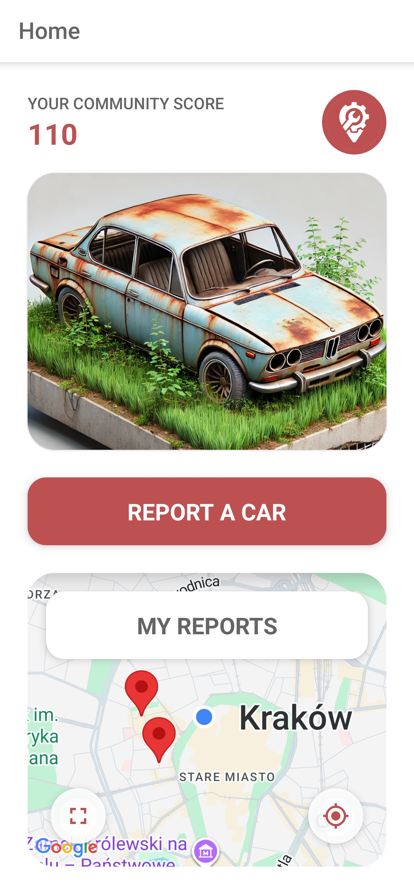
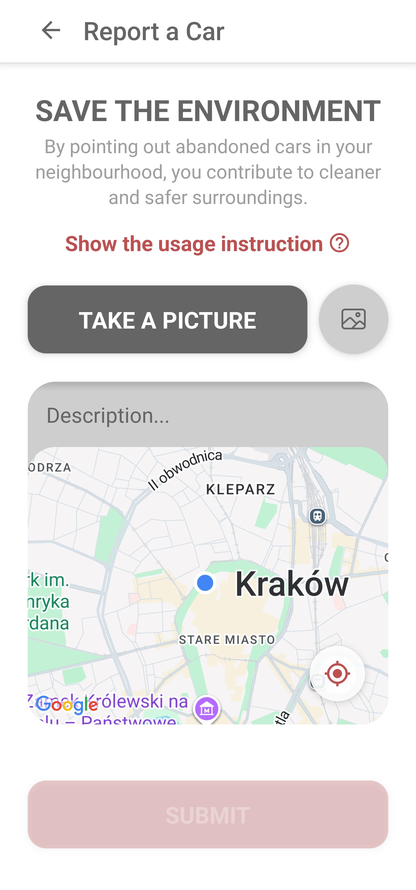
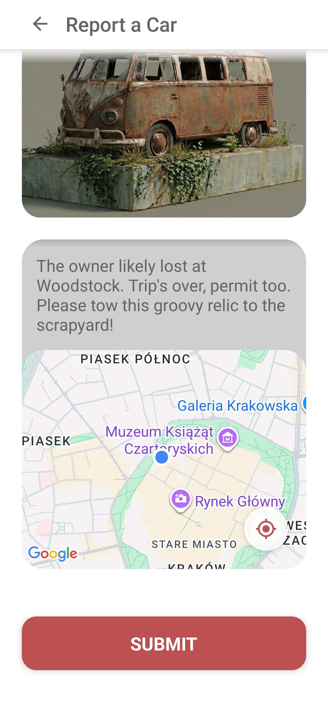
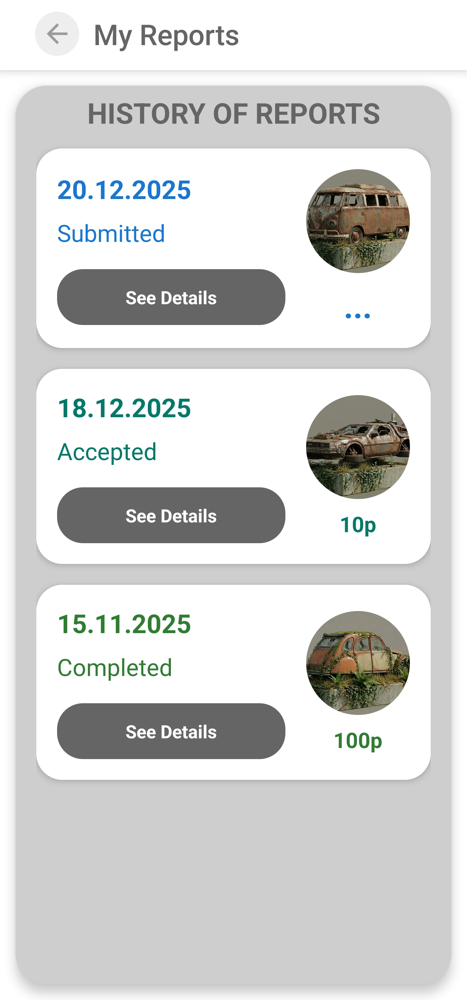
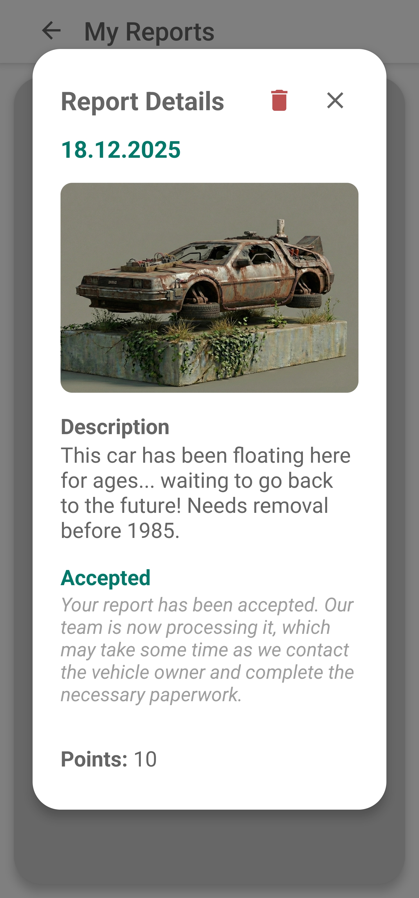

# Rusty 🚗

**Rusty** is a mobile application designed to gamify civic engagement by empowering users to report abandoned vehicles in their neighborhoods. By identifying and reporting these vehicles, you contribute to cleaner, safer streets while tracking your personal impact.

<p align="center">
  <table style="width: 100%; table-layout: fixed;">
    <tr>
      <td align="center"></td>
      <td align="center"></td>
      <td align="center"></td>
      <td align="center"></td>
      <td align="center"></td>
    </tr>
    <tr>
      <td align="center"><b>Home</b></td>
      <td align="center"><b>Report</b></td>
      <td align="center"><b>Filled in Report</b></td>
      <td align="center"><b>My Reports</b></td>
      <td align="center"><b>Report Card</b></td>
    </tr>
  </table>
</p>

---

## 🌟 Features

- **📸 Report Vehicles**: Easily snap a photo, pinpoint the location, and add a description for any abandoned vehicle you find.
- **📊 Track Status**: Monitor your reports in real-time as they move from _Submitted_ to _Accepted_ and finally _Completed_.
- **🏆 Gamification**: Contribute to your community and track your impact with every verified report.
- **🗺️ Interactive Map**: Explore the history of your reported vehicles on a user-friendly map.
- **🌗 Optimized UI**: Enjoy a sleek interface with optimal visibility during the day.
- **🌍 Bilingual Support**: Fully localized in **English** and **Polish**.

---

## 📱 How to Use

1.  **Create an Account**: Sign up using your email.
2.  **Spot a Car**: Look for abandoned vehicles in your area (e.g., flat tires, broken windows, long-term parking).
3.  **Submit a Report**:
    - Tap the **"Report a Car"** button.
    - Take a clear photo of the vehicle.
    - Add a brief description.
    - Confirm the location on the map.
4.  **Track Progress**: Once your report is verified by an admin, you'll see its status update in real-time!

---

## 👨‍💻 For Developers

This section is designed to help developers set up the Rusty project locally.

### Prerequisites

Ensure you have the following installed on your machine:

- **[Node.js](https://nodejs.org/)** (LTS version recommended)
- **Git**
- **Expo CLI**: Install globally via `npm install -g expo-cli`
- **Android Studio** (for Android Emulator) or **Xcode** (for iOS Simulator, macOS only)
- **[Expo Go](https://expo.dev/client)** app on your physical device (optional)

### 🚀 Getting Started

Follow these steps to get the app running:

1.  **Clone the Repository**

    ```bash
    git clone https://github.com/struggyyy/RustyApp.git
    cd RustyApp
    ```

2.  **Install Dependencies**

    ```bash
    npm install
    ```

3.  **Configuration**

    The app requires specific configuration files and environment variables to function correctly. These are **git-ignored** for security reasons.

    - **Environment Variables (`.env`)**:
      Create a `.env` file in the root directory and add your Google Maps API key:

      ```env
      GOOGLE_MAPS_API_KEY=your_google_maps_api_key
      ```

    - **Firebase Configuration**:
      - **Android**: Place the `google-services.json` file in the **root** directory of the project.
      - **iOS**: Place the `GoogleService-Info.plist` file in the **root** directory (if applicable).
      - **Service Account**: The `firebase-service-account.json` is required for certain backend/admin operations.

    > **⚠️ Important**: If you are a collaborator, please request these configuration files (`.env`, `google-services.json`, etc.) from the project lead (@struggyyy).

4.  **Run the Application**

    Start the development server:

    ```bash
    npx expo start
    ```

    - Press **`a`** to open in the **Android Emulator**.
    - Press **`i`** to open in the **iOS Simulator**.
    - Scan the QR code with **Expo Go** to run on a physical device.

### �️ Tech Stack

- **Language**: TypeScript (v5.8)
- **Framework**: React Native (v0.81) via [Expo](https://expo.dev/) (v54)
- **Routing**: [Expo Router](https://docs.expo.dev/router/introduction/) (v6)
- **Backend**: Firebase (v11) (Authentication, Firestore, Storage)
- **Maps**: `react-native-maps` (v1.20) (Google Maps Provider)
- **Styling**: `styled-components` (v6)
- **Internationalization**: `i18next` (v25)

---

**Copyright © 2026 @struggyyy. All Rights Reserved.**
